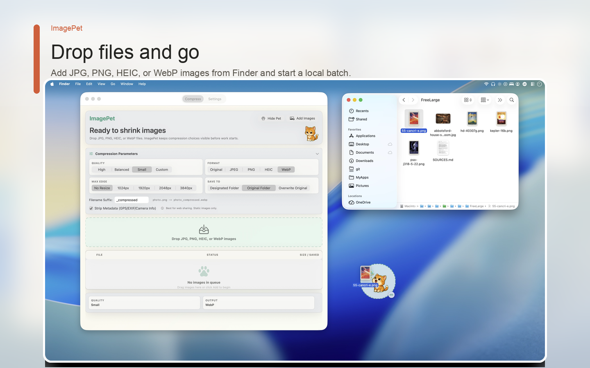

# ImagePet

> **Recommended for most users**: Get ImagePet from the [Mac App Store](https://apps.apple.com/app/id6780180225) for a signed, sandboxed app with automatic updates. This repository keeps the source code open for review, learning, issues, and contributions.
>
> **普通用户建议**：优先从 [Mac App Store](https://apps.apple.com/app/id6780180225) 购买和安装 ImagePet，获得已签名、沙盒化、可自动更新的成品 App。本仓库保持源码开放，便于审阅、学习、反馈问题和参与贡献。



> **TL;DR**: ImagePet is a local-first macOS batch image compressor with an interactive desktop pet progress companion. It supports JPG, PNG, HEIC, and WebP, featuring Finder extensions, Shortcuts actions, and background folder watching—all processed 100% locally on your Mac.
>
> ImagePet 是一个基于 macOS 的本地批处理图片压缩工具，带有一个有趣的桌面宠物进度伴侣。支持 JPG、PNG、HEIC 和 WebP 格式，并集成了 Finder 快捷动作、快捷指令（Shortcuts）以及后台文件夹监控——所有图片处理均 100% 在本地完成，无需上传。

---

ImagePet 是一个 macOS 本地图片压缩小工具。当前核心 workflow 是：

1. Drop JPG, PNG, HEIC, or WebP images into the window, or choose them with Add Images.
2. Choose High, Balanced, or Small quality, an optional max-edge resize limit, and an output format.
3. Write smaller images to a designated folder, the original folder, or overwrite originals after confirmation.
4. Review per-file status and total saved space.

App 支持 `JPG / PNG / HEIC / WebP` 输入，输出可选择 `Original / JPEG / PNG / HEIC / WebP`。JPEG 输出可在能力可用时启用 Advanced JPEG。非覆盖模式永不覆盖已有文件；覆盖原图模式会二次确认并保持每个文件的原始格式。App 全程本地处理，不上传图片。

当前开发重点已经从核心压缩扩展进入 Mac App Store 上线准备闭环。Xcode Cloud 已部署，提交 `build*` 开头的分支会自动触发打包；v0.15 聚焦 App Store Connect metadata、截图、隐私信息、App Review notes、RC 验收和发布说明，不继续扩大压缩格式或系统入口范围。

## Project Shape

项目现在以提交到仓库的 Xcode project 为主入口：

- `ImagePet.xcodeproj`：日常开发、CI、构建和测试使用的主项目文件。
- `Generated/Info.plist`：`ImagePet.xcodeproj` 引用的 app Info.plist。
- `project.yml`：XcodeGen 配置，作为 AI/脚手架辅助工具保留；不是 CI 必需步骤。
- `Sources/ImagePetCore`：可复用压缩内核，不依赖 SwiftUI/AppKit UI。
- `Sources/ImagePet`：macOS SwiftUI GUI app。
- `Sources/ImagePetCLI`：独立命令行工具，依赖 `ImagePetCore`，不依赖 GUI。
- `Entitlements/ImagePet.entitlements`：App Sandbox 和用户选择文件读写权限。
- `Tests/ImagePetTests`：核心压缩、命名规则、CLI、依赖能力和 Apple fixture 测试。
- `Tests/ImagePetUITests`：主 app、Help Center、设置页和关键交互的 UI 测试。

Bundle ID 前缀是 `org.gewill`：

- App: `org.gewill.ImagePet`
- Core framework: `org.gewill.ImagePetCore`
- CLI tool: `org.gewill.ImagePetCLI`
- Tests: `org.gewill.ImagePetTests`

`Package.swift` 仍保留，主要用于快速 `swift test` 和保持 Core 的 SwiftPM 可测试性；日常打开 Xcode 和构建 app 时，以提交的 `ImagePet.xcodeproj` 为准。

CI 应直接使用提交的 `ImagePet.xcodeproj`，不需要在每次构建前运行 XcodeGen。只有当需要大幅调整 target、scheme 或 build setting，并且希望借助 XcodeGen 重新生成项目时，才手动运行 `xcodegen generate`，生成后应检查并提交 `.xcodeproj` 的变化。

## Architecture

### ImagePetCore

`ImagePetCore` 是项目里最重要的边界。它负责“图片如何被压缩”，但不负责“用户如何选择文件、如何拖拽、UI 如何显示状态”。

核心类型：

- `CompressionPreset`：`high / balanced / small` 三档质量，对应 `0.9 / 0.8 / 0.65`。
- `ImageJob` 和 `JobStatus`：描述单张图片的输入、输出、大小、状态和错误。
- `CompressionResult`：单张图片压缩后的结果。
- `ImageCompressing`：压缩服务协议，便于 GUI、测试、未来 CLI 复用。
- `ImageCompressor`：当前 ImageIO 实现。
- `OutputNameAllocator`：生成不覆盖原文件的输出文件名。
- `CompressionError`：把常见失败映射成 UI/CLI 可读错误。

`ImageCompressor` 当前做了这些核心决策：

- 支持输入扩展名：`jpg / jpeg / png / heic`。
- 支持输出格式：原格式、JPEG、PNG、HEIC。
- 输出统一转为标准 sRGB；JPEG/HEIC 使用质量预设，PNG 走无损编码。
- 支持元数据剥离和最大边长缩放。
- 使用 `CGImageSourceCreateThumbnailAtIndex(... kCGImageSourceCreateThumbnailWithTransform: true ...)` 保留基础方向信息。
- 对解码、转换、编码包裹 `autoreleasepool`，减少批量处理时的临时对象驻留。
- 对 input URL 和 output directory 调用 security-scoped resource access，适配 sandbox GUI 场景。
- 非覆盖模式永远不覆盖已有文件；覆盖模式写入临时文件后再替换原文件。

Core 不知道宠物状态、按钮、拖拽、Open Panel、Finder reveal。这些都属于 GUI 层。

### ImagePet GUI

`Sources/ImagePet` 是 macOS SwiftUI app：

- `ImagePetApp.swift`：app entry point，设置 regular activation policy。
- `ContentView.swift`：主界面，包括宠物状态、拖拽区、任务列表、统计和按钮。
- `HelpView.swift`：离线帮助中心，覆盖快速开始、格式、权限、覆盖保护、桌面 Pet、快捷键和隐私。
- `AppSettingsView.swift`：主窗口设置页，包含 General、Desktop Pet、Keyboard Shortcuts、Help & About。
- `DesktopPetView.swift` / `DesktopPetWindowController.swift`：桌面宠物小窗，跟随压缩状态变化。
- `ImagePetStore.swift`：GUI 状态和批处理队列。
- `FolderMonitor.swift` / `FolderWatchManager.swift`：文件夹监听入口，等待新图片写入稳定后触发后台压缩。
- `GlobalShortcutCoordinator.swift`：GUI-only 全局快捷键协调器，基于 `KeyboardShortcuts`，不进入 `ImagePetCore`。
- `ShortcutsIntent.swift`：macOS Shortcuts 动作集成。
- `OutputFolderPanel.swift`：用 `NSOpenPanel` 选择输出目录。
- `OutputDirectoryBookmarkStore.swift`：保存和恢复输出目录 security-scoped bookmark。
- `FileSizeFormatting.swift`：UI 展示用的文件大小格式化。

GUI 层负责：

- 拖拽图片进入窗口。
- 通过 `Add Images` 选择图片，作为拖拽之外的键盘/菜单入口。
- 处理 Finder Quick Action / Services 传入的图片文件。
- 管理文件夹监听并把新图片加入后台压缩流程。
- 暴露 Shortcuts 动作，供系统快捷指令调用压缩能力。
- 首次选择输出目录。
- 保存输出目录 bookmark。
- 最多 2 个任务并发处理。
- 每张图完成后即时更新 UI。
- 管理宠物状态机：`idle / eating / happy / error`。
- 显示或隐藏桌面宠物小窗。
- 打开离线帮助中心。
- 记录用户自定义的全局快捷键，默认不设置任何全局快捷键。
- 处理 `Reveal in Finder`、`Retry Failed`、`Clear List`。

v0.13 已在 GUI 层新增 `LocalNotificationManager` 服务边界，用于管理 `UNUserNotificationCenter` 权限、后台压缩完成摘要、通知动作和通知节流。通知能力仍保持 GUI-only，不进入 `ImagePetCore`。

## Sandbox

App 必须启用 sandbox。当前 entitlements：

```text
com.apple.security.app-sandbox = true
com.apple.security.files.user-selected.read-write = true
```

输入文件来自用户拖拽，输出目录来自用户通过 `NSOpenPanel` 授权选择。GUI 启动后会尝试恢复输出目录 bookmark；如果 bookmark 失效，需要用户重新选择。

## CLI

项目已经包含独立 CLI target。它基于 `ImagePetCore`，用于脚本化或终端批处理，不复用 SwiftUI、Open Panel、宠物状态机或 GUI bookmark 流程。

常用形态：

```bash
imagepet \
  --preset balanced \
  --output /path/to/output \
  /path/to/a.heic /path/to/b.png /path/to/c.jpg
```

CLI 复用：

- `CompressionPreset`
- `ImageCompressor`
- `OutputNameAllocator`
- `CompressionError`
- `CompressionResult`

CLI 不复用：

- `ImagePetStore`
- `ContentView`
- `OutputFolderPanel`
- `OutputDirectoryBookmarkStore`

原因是 CLI 不需要 SwiftUI、`NSOpenPanel`、security-scoped bookmark 或宠物状态机。它应该只接收普通文件路径和输出目录路径，然后调用 `ImagePetCore`。

当前 target 形态：

- Xcode target: `ImagePetCLI`
- SwiftPM executable product: `imagepet`
- Dependency: `ImagePetCore`
- Argument parsing: Swift Argument Parser

CLI 行为：

- `--preset high|balanced|small`，默认 `balanced`。
- `--quality <1...100>` 可用于自定义质量。
- `--format jpg|png|heic|webp|original` 可选择输出格式。
- `--output <directory>` 可指定输出目录。
- 支持多个输入文件。
- 并发仍限制为 `2`，和 GUI MVP 保持一致。
- 每个文件失败不影响整个批次。
- 输出 per-file 结果和最终总计。
- exit code:
  - `0`：全部成功。
  - `1`：部分或全部文件失败。
  - `2`：参数错误或输出目录不可用。

如果 CLI 是 Developer ID 分发的独立工具，通常不需要 App Sandbox。若未来要走 Mac App Store，则更适合把 CLI 当作 app bundle 内的 helper/tool 另行设计，不建议直接把当前 GUI 的 bookmark 流程硬搬到 CLI。

## System Integrations

ImagePet 已经规划并实现多种 macOS 系统入口：

- Finder Quick Action / Services：从 Finder 右键图片后交给 ImagePet 压缩。
- Apple Shortcuts：通过 `AppIntents` 暴露图片压缩动作。
- Folder Watching：监听用户授权的本地文件夹，发现新图片后自动压缩。
- Global Shortcuts：用户可在设置页录制全局快捷键，默认不抢占任何组合键。

这些入口都必须继续尊重 sandbox、security-scoped bookmark、覆盖确认和用户主动授权。v0.13 的通知开发优先补齐这些后台入口的完成反馈和需要操作提示。

## Product Docs

- [MVP PRD](docs/PRD.md)
- [PRD v0.11: App 完整性、帮助中心与可自定义快捷键](docs/PRD_v0.11_app_completeness.md)
- [PRD v0.12: 系统级集成与自动化工作流](docs/PRD_v0.12_system_integration.md)
- [PRD v0.13: 本地通知与发布完整性闭环](docs/PRD_v0.13_local_notifications_and_release_completeness.md)
- [PRD v0.14: Soft Native 主窗口重设计方案](docs/PRD_v0.14_soft_native_main_window_redesign.md)
- [PRD v0.15: Release Candidate 与上线准备](docs/PRD_v0.15_release_candidate_and_distribution.md)
- [PRD v0.16: 桌面 Pet 主题生产与验证管线](docs/PRD_v0.16_desktop_pet_theme_authoring_pipeline.md)
- [Metadata Source](metadata/README.md)
- [Static Website](website/README.md)
- [App Store Connect Metadata Index](docs/APP_STORE_METADATA.md)
- [Progress](docs/PROGRESS.md)
- [Third-Party Notices](docs/THIRD_PARTY_NOTICES.md)


## Run

```bash
./script/build_and_run.sh
```

The script builds the committed `ImagePet.xcodeproj` with `xcodebuild`, signs
the app with the sandbox entitlements in `Entitlements/ImagePet.entitlements`,
and launches it from project-local `DerivedData`.

## XcodeGen

```bash
xcodegen generate
open ImagePet.xcodeproj
```

XcodeGen is optional. It is useful for bootstrapping or AI-assisted project
rewrites, but the generated `ImagePet.xcodeproj` is committed and should be the
source used by CI.

## Tests

```bash
swift test
xcodebuild -project ImagePet.xcodeproj -scheme ImagePet -configuration Debug -derivedDataPath DerivedData -destination 'platform=macOS' test
```

如果本地存在 `TestImages/Apple`，`AppleFixtureCompressionTests` 会使用 Apple Newsroom 测试素材跑一遍真实压缩；如果素材不存在，该测试会自动 skip。

## Open Source & Contributing (开源与贡献)

ImagePet 已正式采用 **MIT License** 开源，我们非常欢迎来自社区的贡献与反馈！

### 开源自查与准备工作 (Preparation Checklist)

在将仓库公开发布 (Make Public) 或提交 Pull Request 之前，请确保完成以下自查工作：

1. **证书与签名 (Signing & Sandbox)**:
   - 本地开发建议使用 Xcode 自动管理签名 (Apple Development)。请勿提交带有硬编码或敏感私有证书的 `project.pbxproj` 文件。
   - 必须保持 App Sandbox (`.entitlements`) 开启，确保所有的本地文件读写操作遵循沙盒机制，并正确使用安全书签 (Security-scoped bookmarks)。

2. **忽略构建产物 (Git Cleanliness)**:
   - 请检查并确保未提交 `DerivedData`、`.build`、`xcuserdata`、`.xcuserstate` 以及任何本地测试图片（如 `TestImages`）。

3. **提交规范 (Conventional Commits)**:
   - 项目使用约定式提交规范。请确保您的 Commit Message 格式为：`<type>(<scope>): <subject>`（例如 `feat(app): add batch compression UI`, `fix(core): preserve output filename uniqueness`）。

### 贡献引导

- **提交反馈**: 如果您在使用中遇到问题或有新功能想法，请通过 [GitHub Issues](https://github.com/gewill/ImagePet/issues) 提交，我们会根据提供的运行环境模板进行跟进。
- **核心开发边界**:
  - 任何**图片压缩/编码/解码行为**相关的修改应严格限制在 `Sources/ImagePetCore` 内部，不能引入任何 SwiftUI/AppKit UI 或 App 主运行时的依赖。
  - 主 GUI 和交互逻辑依然在 `Sources/ImagePet` 下进行迭代。

## License

本项目基于 [MIT License](LICENSE) 协议开源。
