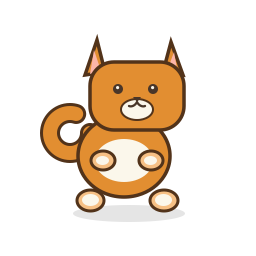
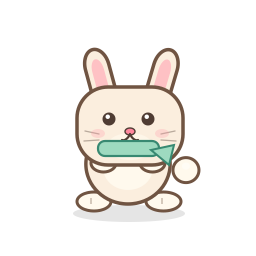
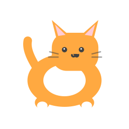
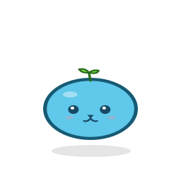
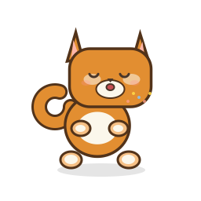
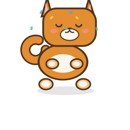
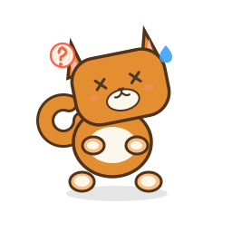
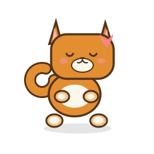
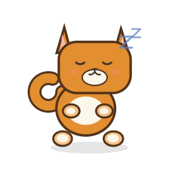

# ImagePet 桌面宠物主题设计规范

> 本文档描述 ImagePet 桌面宠物的完整素材规范，可直接交给 AI 图像生成工具或设计师作为参考。
> 单主题风格示例见 [CUTE_CAT_STYLE_GUIDE.md](CUTE_CAT_STYLE_GUIDE.md)。

---

## 1. 产品背景

ImagePet 是一个 macOS 图片压缩工具，桌面宠物是它的核心交互元素。宠物浮动在桌面上，通过不同的动画状态反映压缩进度（空闲 → 吃东西 → 完成 / 出错）。用户可以切换不同的宠物主题。

宠物不是一个通用的吉祥物平台，它是压缩 workflow 的可视化反馈。每个状态的动画设计应当让用户一眼就能看出当前压缩进度。

---

## 2. 现有主题参考

四套现有主题的 idle 静帧：

| ShibaInu | MochiBunny | CuteCat | PixelSlime |
|:---:|:---:|:---:|:---:|
|  |  |  |  |
| 柴犬，圆润卡通风格，粗描边 | 麻薯兔，长耳朵与薄荷围巾 | 可爱猫咪，与柴犬同风格体系 | 像素史莱姆，简约可爱 |

---

## 3. 技术规格

| 属性 | 要求 |
|---|---|
| **画布尺寸** | 256 × 256 px（正方形） |
| **格式** | PNG，带 Alpha 透明通道 |
| **背景** | 完全透明，角色浮在桌面上 |
| **色彩空间** | sRGB |
| **单帧文件大小** | 建议 < 30 KB |
| **全主题体积** | < 3 MB |
| **单动画帧数上限** | ≤ 24 帧 |
| **命名** | `frame_000.png`, `frame_001.png`, … 三位数零填充 |
| **渲染区域** | 角色居中，四周留 ~20 px 安全边距（给阴影/特效留空） |

> [!IMPORTANT]
> 所有帧**必须**保持角色在画布中的位置一致（锚点居中），否则动画会抖动。

---

## 4. 目录结构

每个主题是一个以主题名命名的文件夹，放在 `Sources/ImagePet/Resources/` 下，包含 **9 个动画子文件夹**：

```
ThemeName/
├── idle/          # 空闲呼吸  — 循环
├── eating/        # 正在压缩  — 循环
├── done/          # 压缩完成  — 播放一次
├── issues/        # 出错/警告 — 循环
├── dragHover/     # 拖拽悬停  — 循环
├── petting/       # 鼠标悬停  — 循环
├── stretch/       # 空闲变体  — 播放一次
├── yawn/          # 空闲变体  — 播放一次
└── sleep/         # 空闲变体  — 循环
```

文件夹名必须与 `PetAnimation` enum 的 `rawValue` 完全一致（区分大小写）。

---

## 5. 动画详细说明

### 5.1 帧数与播放方式

| 动画 | 推荐帧数 | 播放 | 说明 |
|---|---|---|---|
| `idle` | 8 | 循环 | 默认状态，轻微呼吸/摇摆 |
| `eating` | 6 | 循环 | 张嘴咀嚼，表示正在压缩图片 |
| `done` | 12 | 一次 | 开心庆祝，停在最后一帧 |
| `issues` | 8 | 循环 | 困惑/难过，表示有文件失败 |
| `dragHover` | 4 | 循环 | 期待/张嘴等待，用户拖拽文件悬停时 |
| `petting` | 8 | 循环 | 开心摇尾巴/眯眼，鼠标悬停触摸 |
| `stretch` | 12 | 一次 | 伸懒腰，空闲一段时间后随机触发 |
| `yawn` | 10 | 一次 | 打哈欠，空闲一段时间后随机触发 |
| `sleep` | 8 | 循环 | 打瞌睡，空闲时备用 |

帧数为推荐值，允许在 ≤ 24 帧范围内调整。允许使用 hold frame（重复帧）来实现角色表演中的停顿。

### 5.2 播放速率

- 目标帧率 **8–12 FPS**，默认 10 FPS
- 节能模式下自动降至 **5 FPS**
- 设计动画时按 10 FPS 计算时长（如 8 帧 = 0.8 秒一个完整循环）

---

## 6. 角色造型指南

### 造型原则
- 使用 chibi 比例：大头、紧凑身体、小四肢、可识别的外轮廓
- 在 Mini 模式下（渲染区约 64 pt 宽）角色必须清晰可辨
- 追求不对称的细节感，不要只用圆形和三角形堆砌——最终轮廓应当读起来是一个"设计过的角色"，而不是一个图表
- 每个核心业务状态（idle / dragHover / eating / done / issues）应当有**不同的轮廓**，让用户通过剪影就能区分

### 配色原则
- 选取 1 个主色 + 1 个辅色 + 描边色
- 描边使用暖色调深棕或深灰，适度使用以保持小尺寸可读性
- 避免使用过于刺眼的纯色，用柔和去饱和的色调
- 特效色点缀：蓝色用于汗滴，红/橙仅用于 issues 警示元素

**CuteCat 配色参考**：暖橙皮毛、暖棕描边、暖奶油色肚皮与爪垫、柔和鲑粉色耳内与腮红。

**MochiBunny 配色参考**：米白麻薯色身体、暖棕描边、柔和粉色耳内与鼻头、薄荷绿围巾作为小尺寸识别点。

---

## 7. 各状态动画语言

### idle（空闲）
安静的呼吸、尾巴微漂、偶尔眨眼。轮廓几乎不动。这是用户看到最多的状态，生动但不分散注意力。


### eating（正在压缩）
脸颊和嘴巴的运动传达"正在吃掉/消化图片"的隐喻。可以加小图片碎屑，前提是在小尺寸下仍然可读。



### done（完成）
用预备动作 → 跳跃 → 着地的节奏。撒花/星星特效应当衬托角色而非遮挡角色。最后一帧定格在满足的表情上。



### issues（出错）
避免只用死鱼眼或叉叉眼。优先使用困惑的歪头、汗滴、小型警告/问号提示。表达"出了问题"但不要太可怕。



### dragHover（拖拽悬停）
角色前倾，像是在等着被喂食图片。传达"把文件放到我这里！"的期待感。


### petting（鼠标悬停抚摸）
柔和的闭眼、腮红、更快的尾巴摇摆。享受被抚摸的快乐反馈。



### stretch（伸懒腰）和 yawn（打哈欠）
动作必须大到在 Mini 尺寸下能看出轮廓变化。从正常姿势出发 → 极端姿势 → 回到正常。一次性播放。

### sleep（打瞌睡）
足够安静以传达低能量感。如果加 "Z" 标记，必须在小尺寸下仍然可读。



---

## 8. 画面显示上下文

宠物在桌面上的实际显示区域：

| 模式 | 窗口尺寸 | 角色渲染区 | 说明 |
|---|---|---|---|
| Mini | 80 × 80 pt | 72 × 72 pt | 只显示角色，无 UI 控件 |
| Full | 192 × 176 pt | 72 × 60 pt | 角色 + 标题 + 按钮面板 |

- 256 px 的源图会被缩小到约 64 × 56 pt 渲染（Retina 下对应 128 × 112 px）
- 角色下方有圆角色块背景和阴影
- 窗口背景完全透明，角色直接浮在桌面上
- 角色不能在 Mini 或 Full 视图中被裁切

> [!NOTE]
> 虽然角色在 Full 模式下只显示 60 pt 高，但 256 px 源图保证了 Retina 屏清晰度和未来扩展空间。

---

## 9. 交付清单

为新主题生成一套完整素材，需要交付：

```
NewThemeName/
├── idle/           8 帧 (frame_000.png ~ frame_007.png)
├── eating/         6 帧 (frame_000.png ~ frame_005.png)
├── done/          12 帧 (frame_000.png ~ frame_011.png)
├── issues/         8 帧 (frame_000.png ~ frame_007.png)
├── dragHover/      4 帧 (frame_000.png ~ frame_003.png)
├── petting/        8 帧 (frame_000.png ~ frame_007.png)
├── stretch/       12 帧 (frame_000.png ~ frame_011.png)
├── yawn/          10 帧 (frame_000.png ~ frame_009.png)
└── sleep/          8 帧 (frame_000.png ~ frame_007.png)

共 76 帧 PNG 文件
```

### 集成步骤
1. 将主题文件夹放入 `Sources/ImagePet/Resources/`
2. 在 `AppSettingsView.swift` 的主题选择列表中添加一张卡片
3. 无需修改动画代码——`ThemeCache` 会自动按文件夹名加载

### 验收清单
- [ ] idle 帧在 64 pt 下不依赖文字标签即可识别为目标角色
- [ ] 五个核心业务状态（idle / dragHover / eating / done / issues）各有不同的轮廓
- [ ] 角色在 Mini 和 Full 视图中不被裁切
- [ ] 所有帧尺寸为 256 × 256 px 透明 PNG
- [ ] 文件名遵循 `frame_000.png` 命名规则
- [ ] 全主题文件体积 < 3 MB
- [ ] 单动画帧数 ≤ 24
- [ ] 资源测试（如有）验证尺寸、帧数和总体积通过

---

## 10. AI 生图 Prompt 模板

以下模板可直接用于 AI 图像生成工具：

### 通用角色描述
```
Design a cute [动物/角色名] character for a macOS desktop pet app.
The character should be centered on a 256×256 transparent PNG canvas
with ~20px safety margin. Style: [圆润卡通/像素风/扁平矢量].
Use chibi proportions: oversized head, compact body, small paws.
Prefer asymmetric details over perfect geometry.
The character must be recognizable when scaled down to 64px wide.
```

### 各状态 Prompt

```
idle:      [角色] standing relaxed, subtle breathing, tail drift, occasional blink, silhouette barely moves, 8 frames
eating:    [角色] chewing with mouth open, cheek motion, small image crumbs, compression metaphor, 6 frames
done:      [角色] anticipation → jump → settle, sparkles/confetti support not cover, stop on last frame, 12 frames
issues:    [角色] confused tilt, sweat drops, small warning cue, avoid only dead/X eyes, 8 frames
dragHover: [角色] leaning forward, excited, mouth ready to catch, waiting to be fed, 4 frames
petting:   [角色] soft closed eyes, blush, faster tail wag, enjoying being petted, 8 frames
stretch:   [角色] full body stretch, silhouette must change visibly at small size, 12 frames
yawn:      [角色] big yawn, mouth opens wide then closes, sleepy expression, 10 frames
sleep:     [角色] dozing off, eyes closed, subtle breathing, small Z marks if readable, 8 frames
```

> [!TIP]
> 生成序列帧时，建议先生成 frame_000（关键帧），确认风格后再生成其余帧。循环动画的首尾帧应能自然衔接；一次性动画应干净收尾。
