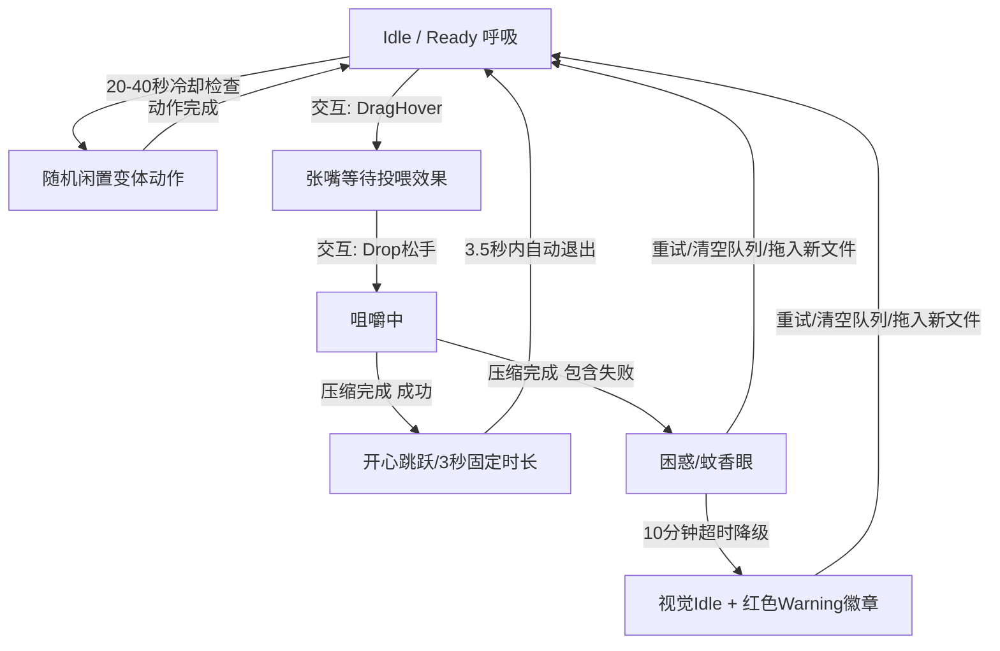

# ImagePet PRD v0.6: Desktop Pet Rich Built-in Animations (MVP)

## 1. 版本定位

在 ImagePet v0.5 中，我们成功实现了桌面 Pet 的 **Mini / Full 双态模式** 以及轻量控制流。但目前的 Pet 依然使用系统 Emoji（如 🐡、😵、😋 等）来表达状态。

ImagePet v0.6 的核心目标是：
```text
实现“桌面宠物动画的极简可行产品 (MVP)”，证明高品质内置动画能显著提升工具的可玩性与完成反馈，坚决避免在当前阶段进行“资产平台化”重构。
```

我们将 v0.6 锁定为：
1. **单一内置动画主题**：P0 仅交付一套精心设计的 `Cute Cat`（透明背景猫咪）主题。
2. **轻量实例化的动画引擎**：使用非单例的 `FrameAnimator` 实例，由各自的 ViewModel 持有，避免状态污染。
3. **基于 Timer 与 CGImage 的轻量渲染**：仅使用 Swift `Timer` 驱动，排除 CVDisplayLink；直接使用 `CGImage` 缓存和渲染，相比 `NSImage` 更加底层和轻量。
4. **一次性解码缓存**：主题激活时，一次性将当前主题所有序列帧解码并缓存于内存（ThemeCache），避免切换状态时因磁盘读取导致卡顿。
5. **高度可预测的状态退出**：Done 状态在 3.5 秒内自动退出并返回 Idle；Issues 状态在 10 分钟后进行视觉降级，但业务状态不重置，保留红点徽章与失败摘要。
6. **防重复的闲置变体**：闲置变体小动作增加“冷却”与“防连续重复”判定。
7. **极简设置，无 Live Preview**：去除复杂的设置页实时预览，以静态缩略图展示主题，切换主题直接作用于桌面 Pet。

*注：多主题、自定义资产导入、沙盒书签持久化等功能全部移入后续版本。*

### 1.1 精美动画素材的硬约束

作为桌面宠物应用，最关键的体验在于动画素材的“灵魂”而非生硬的代码缩放。P0 交付的 `Cute Cat` 主题素材需具备高水平的逐帧动效（例如猫咪呼吸时的起伏、尾巴的轻微摆动、打哈欠时耳朵的收缩等细节），坚决避免仅通过代码进行单纯的位置移动或整体缩放形变来实现动效，以此确保用户第一眼有“哇，这个压缩工具有生命力”的惊喜感。

---

## 2. 设计简报

*   **产品对象**：ImagePet macOS 桌面 Pet 动效系统。
*   **设计对象**：内置猫咪序列帧、非单例帧动画引擎、动画预加载缓存、状态平滑退出与冷却逻辑。
*   **技术范围**：
    *   在主窗口中新增“桌面宠物”设置标签页，允许开启/关闭桌面宠物及调整能耗设置。
    *   在 `Sources/ImagePet` 增加帧渲染引擎与交互模块。
    *   **不改变** `ImagePetCore` 的压缩逻辑与沙盒安全路径。

---

## 3. 技术可行性与架构设计

### 3.1 帧渲染引擎 (FrameAnimator)

*   **非单例设计**：`FrameAnimator` 必须是普通的 `ObservableObject` 类，而不是 Singleton。
    *   由 `DesktopPetViewModel` 或对应视图控制器创建并持有。
    *   如果未来有 Preview 视图或测试用例，它们应当创建各自独立的 `FrameAnimator` 实例，防止多视图下状态相互污染。
*   **Timer 驱动**：P0 明确**仅使用 Swift `Timer`** 作为帧率驱动器（8 - 12 fps）。**不使用** `CVDisplayLink`（防止过度设计，保持逻辑简单可控）。
*   **CGImage 渲染**：`FrameAnimator` 内部发布的主帧对象类型为 `CGImage`，SwiftUI 层直接使用 `Image(decorative:cgImage, scale:...)` 进行绘制，降低 AppKit 包裹开销。

### 3.2 资源预加载与内存缓存 (ThemeCache)

为了消除播放动画时的磁盘读取 IO 延迟，避免卡顿：
*   **触发时机**：当桌面宠物启动或切换主题时，一次性将该主题所有状态下的 PNG 序列帧读入内存。
*   **数据模型**：
    ```swift
    enum PetAnimation: String, CaseIterable, Equatable {
        case idle
        case dragHover
        case eating
        case done
        case issues
        // P1/未来动作变体扩展
        case stretch
        case yawn
        case petting
        case sleep
    }

    struct ThemeCache {
        let frames: [PetAnimation: [CGImage]]
    }
    ```
*   由于单主题资源总量极小（≤ 3MB），一次性缓存对内存无显著影响，且能带来极致平滑的动效表现。

---

## 4. 动画状态机与状态退出条件

### 4.0 状态解耦：业务状态机与交互状态机双层架构

为了防止业务状态与本地 Hover 或拖入交互相互覆盖、导致状态逻辑混乱，我们采取**双层解耦状态架构**：
1.  **业务状态 (Display State)**：`Idle` / `Eating` / `Done` / `Issues`。决定了当前 Pet 的核心生命周期与 UI 面板状态。
2.  **交互状态 (Interaction State)**：`None` / `Hover` (鼠标指针悬停于 Pet 区域) / `DragHover` (外部图片拖拽悬停于 Pet 区域)。

这两者在表现层进行正交结合渲染，由 View/ViewModel 驱动播放：
*   如果 `Display State == .idle` 且 `Interaction State == .none`：播放 `idle` 呼吸或闲置变体动作。
*   如果 `Display State == .idle` 且 `Interaction State == .hover`：播放抚摸动画（如眯眼摇尾巴），不触发业务状态跳转。
*   如果 `Interaction State == .dragHover`（当业务状态非 `.eating` 时）：播放等待投喂动画（如身体前倾、张大嘴巴）。
*   如果 `Display State == .eating`：直接播放咀嚼动画，不再受 Hover 抚摸或 DragHover 状态打扰。

第一版聚焦于以下核心状态的动画映射：



### 4.1 核心状态表现与防连续重复判定

*   **Idle (空闲)**：
    *   默认播放极微弱起伏的呼吸循环（`idle`）。
    *   **闲置变体判定**：每 20~40 秒进行一次触发判定。当判定通过时，从可选变体（如伸懒腰 `stretch`、打哈欠 `yawn`）中选择一个播放。
    *   **防重复冷却**：引入 `lastVariant` 记录，**禁止连续两次播放同一个变体**，确保动效显得自然生动。
*   **Done (全部完成)**：
    *   播放庆祝序列帧动画。
    *   **退出逻辑**：**在 3.5 秒内自动恢复**至 `Idle` 呼吸循环。测试中使用 `waitForIdle(timeout: 4.0)` 进行异步等待，避免硬卡时间导致 Flaky 测试。
*   **Issues (有失败/取消)**：
    *   播放困惑/眩晕动画。
    *   **超时视觉降级逻辑 (Store 状态不重置)**：
        *   为了防止画面无限期卡在异常表情让用户误以为是 Bug，在持续 10 分钟无操作后，**视觉表现层降级为播放 Idle 呼吸动画，并在宠物一角保留红色 Warning 徽章，但 `ImagePetStore` 中的业务状态保持 `.issues` 不变**（即 `displayState` 依然为 `.issues`，仅视觉驱动器切换帧序列，且 UI 附加呈现小红点）。这确保了业务状态的真实性，使 Retry 与失败任务数据在用户回来看时不会丢失。
        *   **失败摘要保留机制 (防止用户漏看错误)**：降级显示并保留红点徽章后，当用户首次点击/展开 Full 面板时，**Full 面板依然保留最后一次批次压缩的失败摘要**（例如：“上批次有 2 张图片压缩失败”），并展示重试/打开 App 等控制项，而不是展示 Ready 态。当用户点击重试、清除队列或投喂新文件后，错误信息和红点徽章彻底清除。

---

## 5. 交互设计（Hover 反馈与点击展开）

*   **Hover 抚摸 (P0)**：
    *   当鼠标指针移入 Pet 区域（Hover 状态激活）时，更新本地 `Interaction State = .hover`。若当前业务状态处于 `Idle`，Pet 播放抚摸反馈动画（如眯眼摇尾巴），并在 Full 模式下重置 30 秒自动收回计时器。
*   **点击展开 (P0)**：
    *   在 Mini 模式下点击 Pet，直接触发展开 Full 模式（沿用 v0.5 标准路径，不增加额外的随机点击打扰动效，防止逻辑冗余）。
*   *删除一切眼球追踪（包括局部和全局）以及“点击特定身体部位”的判定逻辑。*

---

## 6. 动效性能与系统占用约束 (硬性指标)

### 6.1 资源体积与帧率硬约束 (Budget)
*   **内置资源总大小**：`≤ 8MB`。
*   **单主题资源大小**：`≤ 3MB`（单帧分辨率控制在 `128x128` 至 `256x256` 之间）。
*   **单动作序列帧上限**：`≤ 24 帧`。
*   **帧率 (fps)**：固定为 `8 - 12 fps`。
*   **ThemeCache 解码耗时 (Debug Telemetry Target)**：
    *   *注：解码时长与硬件机器高度相关，不作为发布阻断指标。*
    *   在 Debug 构建中，通过日志输出记录 ThemeCache 一次性解码时长。设计目标为 `< 100ms`；若在主流 Apple Silicon 设备上超过 200ms，需发出 Warning 提示优化或精简序列帧体积。
*   **首次渲染可见延迟**：Pet 浮窗首次出现时的渲染延迟必须 `< 150ms`（防止读取图片出现明显白屏卡顿）。

### 6.2 按需暂停与能耗控制
当以下任意事件触发时，**必须立刻停止**定时器刷新，注销所有动画循环：
1.  桌面 Pet 窗口被关闭或隐藏。
2.  整个 App 处于隐藏/最小化状态。
3.  系统屏幕睡眠、休眠或锁定。
4.  系统 `Reduce Motion`（减弱动态效果）开启。此时**暂停播放动画刷新 Timer**，Pet 画面降级显示对应状态的静态单帧 PNG。**注意：这仅停止视觉刷新定时器，并不暂停或影响后台状态更新和压缩进度更新**（例如：Completed/Total 数据、进度条数值和详情文本仍正常实时刷新）。

---

## 7. GUI 设置界面设计

在主窗口中，新增一个 **Desktop Pet 设置标签页**：

*   **主题选择 (Theme Selector)**：
    *   内置 1 套 P0 主题：`Cute Cat`（猫咪）- 默认。展示该主题的静态说明与示意图。
    *   *移除 Live Preview 实时预览功能。点击选择主题直接将设置保存并同步应用于桌面 Pet。*
*   **能耗与交互控制**：
    *   **开启闲置变体动作** 开关（默认开启）：关闭后，Pet 在空闲时仅执行低频的微弱呼吸，不再周期性地触发闲置小动作。
    *   **开启 Hover 抚摸反馈** 开关（默认开启）：关闭后，鼠标 Hover 抚摸反馈被禁用（点击 Mini 展开 Full 作为 P0 核心功能，不受此开关影响）。
    *   **节能播放模式** 开关（默认关闭）：开启后，Pet 动画帧率减半播放。

---

## 8. 功能拆分与发布计划

### P0：v0.6 必须交付 (Desktop Pet Animation MVP)
*   基于独立实例 (非单例) 的 `FrameAnimator` 引擎，使用 `Timer` 驱动帧刷新。
*   内置 `Cute Cat` 主题的透明 PNG 序列帧，以及在主题激活时的一次性 `ThemeCache` 解码内存缓存。
*   五状态状态机：`Idle` / `DragHover` / `Eating` / `Done` (在 3.5s 内返回 Idle) / `Issues` (10分钟超时视觉降级回 Idle 并保留红点提示，保持 store 状态不变)。
*   Idle Variant（打哈欠等动作）触发间隔冷却，以及防连续重复机制。
*   Hover 抚摸反馈。
*   Reduce Motion 静态降级，以及窗口隐藏/App隐藏/屏幕睡眠时的完全暂停。
*   能耗控制开关（开启/关闭闲置动作，开启/关闭 Hover 抚摸反馈，节能半帧播放）。
*   资源硬约束：内置资源 ≤ 8MB，单主题 ≤ 3MB，帧率 8-12fps，单动效帧数 ≤ 24。

### P1：v0.6.1 / 后续小版本扩展 (润色与多主题)
*   追加内置 `Pixel Slime`（像素粘液）与 `Shiba Inu`（柴犬）动画主题。
*   主窗口设置中加入实时 Preview 预览渲染。
*   点击 Mini 状态随机触发惊喜弹跳互动。
*   Eating 状态根据当前压缩任务并发数自动调整咀嚼速率。

### P2：v0.7 之后评估 (自定义资产平台化)
*   支持自定义资产文件夹导入与 `config.json` 解析。
*   Security-Scoped Bookmarks 沙盒书签持久化存储自定义路径。
*   自定义资产包 `.zip` 打包导入。
*   音效支持。

---

## 9. 自动化与手动测试计划

### 9.1 自动化测试 (XCUITest)
1.  `testDoneStateAutoExitsAfterThreeSeconds`：验证批量压缩全部成功后，Pet 状态在 3.5 秒内自动返回 Idle（测试中使用 `waitForIdle(timeout: 4.0)` 进行异步等待，避免硬卡时间导致 Flaky 测试）。
2.  `testIssuesStateDegradesAfterTimeout`：模拟 Issues 状态进入并超时，验证 10 分钟后 Pet 状态退回 Idle，但界面上仍保留红色 Warning 徽章标识。
3.  `testReduceMotionDisablesTimer`：模拟开启系统减弱动态效果，验证定时器注销，Pet 展示为静态 PNG 帧。

### 9.2 手工验收要点
*   **切换主题免卡顿**：在主窗口切换主题，检查桌面 Pet 是否立刻无缝重载动画，无白屏或 IO 卡顿。
*   **10分钟降级提示**：确认 Issues 异常在持续 10 分钟无操作后，表情是否恢复为正常的 idle，且小红点/Warning Badge 正确留存。
*   **休眠暂停验证**：隐藏桌面 Pet 窗口后，通过 Xcode 调试器确认没有任何 Timer 在后台运行。
